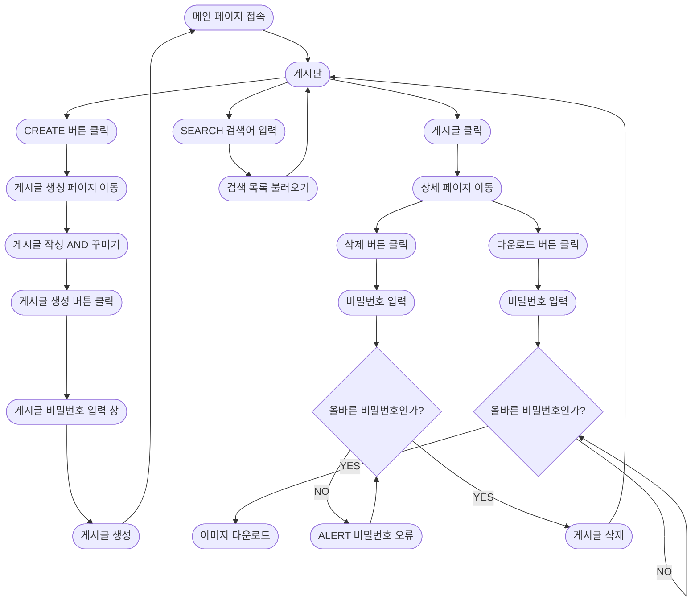
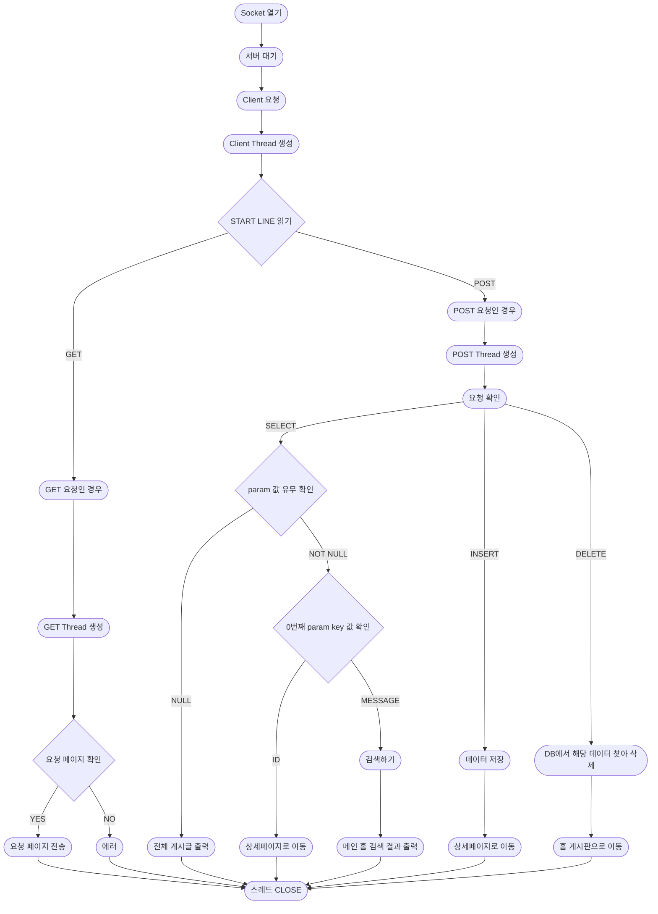

# NewYearResolution
Network Programming Project (SWU)

### ✅ 프로젝트 소개

신년 목표 세우기 New Year Resolution 웹 서비스

2021년 크리스마스 전, 사람들에게 자신의 트리를 공유할 수 있게 하는 ‘내 트리를 꾸며줘!’ 웹 서비스가 있었다. 트리로 갈 수 있는 링크를 타고 들어가면 트리 주인을 제외한 다른 사람들이 메세지를 장식할 수 있도록 하고, 트리의 주인이 크리스마스 당일에 내용을 확인할 수 있는 서비스이다. 많은 사람들에게 좋은 경험을 주었고 올해도 시행될 산타파이브의 크리스마스 트리를 모티브로 삼아 웹 서비스를 개발한다.

<aside>
🌅 새해를 맞기 전 자신의 신년 목표를 세우고 공유할 수 있는 웹 서비스**로, 스스로 자신의 신년 목표를 쓰고, 다른 사람들의 목표를 보면서 동기부여를 받을 수 있도록 한다.

</aside>

- 서비스 이용자들에게 동기부여를 받을 수 있는 기회를 제공한다
- 꾸밈 요소를 제공하고 이를 이미지 출력하여 보관할 수 있도록 한다.

---

### ✅ 프로젝트 내용 및 진행 과정

**주요 기능**

- **개인의 신년 목표 생성**
    - 게시글 주인을 식별할 수 있는 User_id를 제공한다.
    - 닉네임, 게시글 제목과 내용을 작성할 수 있도록 한다.
- **신년 목표 출력 및 꾸밈 기능**
    - 배경 색상이나 글자 색상 같은 변경할 수 있도록 한다.
    - 자신의 게시글을 이미지로 출력할 수 있도록 한다.
- **신년 목표 게시판 기능**
    - 모든 게시글을 볼 수 있는 게시판을 생성한다.

---

### ✅ 과제  주제

1. **다양한 통신 방법 및 I/O를 이용한 개발**
    1. **ServerSocket 사용**
    2. **Thread 사용**
        
2. **프로토콜 분석을 통해 특정 프로토콜이 적용된 서비스 개발**
    1. **HTTP 프로토콜 분석**
        1. **하이퍼텍스트(HTML) 문서를 교환하기 위해 만들어진 protocol(통신 규약)**
        2. **Request(요청)/Response(응답)에 맞춰서 통신**
            
3. **DB 사용**
    1. **Mongo DB 사용**
    2. ~~지금 다시 고르라고하면 MySQL RDS..~~

<aside>
💡 네트워크 프로그래밍 과제로써 통신 framework 사용 금지

</aside>

---

## 기능 플로우 차트

## 서버 구현 플로우 차트

## 상세보기
https://www.notion.so/nasong/New-Year-Plan-b829e3ae281046c2a131ae6999c6c989
